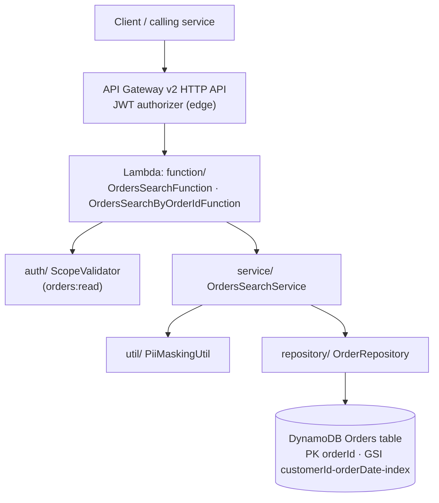
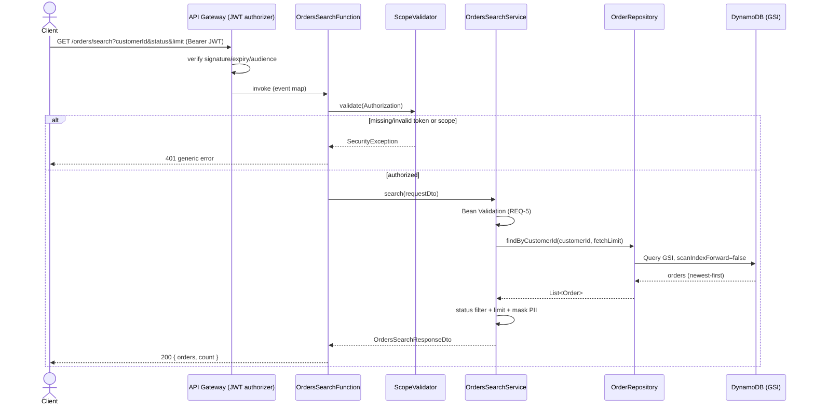
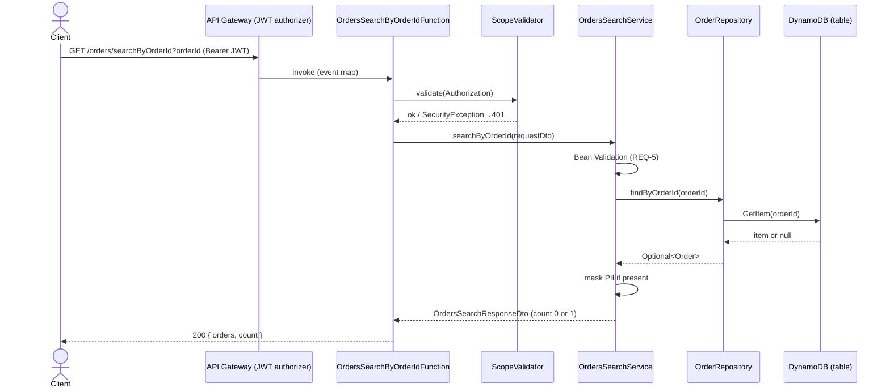
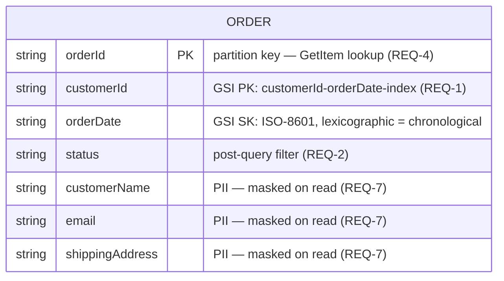

# Design: Orders Search

**Status:** Complete
**Traces to:** `requirements.md` — REQ-1 … REQ-9
**Owner:** Orders service team
**Last updated:** 2026-09-17

> Regenerated to follow `.kiro/steering/org/design-template.md`. Reverse-engineered
> from the implemented code under `src/src/main/java/com/arc/orderslambda`. Documents
> the Orders Search capability (Maven artifact `com.arc:orders-lambda`) that the
> `payments-service` repository actually implements. See `.kiro/steering/product.md`.

---

## 1. Overview

Orders Search is a serverless read API that lets an authenticated, `orders:read`-scoped
caller retrieve a customer's orders (newest-first, with an optional status filter and a
bounded limit) or fetch a single order by its id. It runs as an AWS Lambda (Spring Cloud
Function, Java 21) behind an API Gateway v2 HTTP API and is backed by a DynamoDB Orders
table. All customer PII is masked before it leaves the service tier. This design satisfies
`requirements.md` (REQ-1 … REQ-9).

## 2. Goals & Non-Goals

**Goals**
- Return a customer's orders newest-first, with optional case-insensitive status filtering
  and a bounded result limit (REQ-1, REQ-2, REQ-3).
- Provide a fast primary-key lookup of a single order by id (REQ-4).
- Validate all input at the boundary and reject malformed requests with `400` (REQ-5).
- Authenticate and authorize every request via a Bearer JWT carrying `orders:read` (REQ-6).
- Mask all customer PII before it leaves the service and keep it out of logs (REQ-7).
- Return predictable, safe, generic errors without leaking internal detail (REQ-8).
- Resolve all environment-specific values from env vars — no hardcoded config (REQ-9).

**Non-Goals**
- No write/mutation path (create, update, cancel). This service is read-only.
- No order-state transitions; `status` is read and filtered, never mutated.
- No user interface — this is a machine-to-machine HTTP API.
- No cross-customer or admin-wide search; queries are customer-scoped or by `orderId`.
- Edge JWT signature/expiry/audience verification is owned by the API Gateway authorizer,
  not this service (the Lambda does a defence-in-depth scope check only).

## 3. Requirements Traceability

| Requirement ID | Addressed by (section) |
|---|---|
| REQ-1 Search by customer | 4 (Architecture), 5 (Data Model), 6 (API), 8 (Failure Modes), 10 (Testing) |
| REQ-2 Optional status filter | 4, 6, 10 |
| REQ-3 Result limit / fetch bound | 4, 6, 9 (Performance), 10 |
| REQ-4 Lookup by orderId | 4, 5, 6, 8, 10 |
| REQ-5 Request validation | 6, 7 (Security), 8, 10 |
| REQ-6 AuthN / AuthZ | 4, 7, 8, 10 |
| REQ-7 PII masking | 4, 5, 7, 10 |
| REQ-8 Error handling & responses | 6, 8, 10 |
| REQ-9 Configuration | 4, 7, 11 (Rollout) |

Every requirement maps to at least one design element. No orphan requirements.

## 4. Architecture

Layered Lambda, one responsibility per package, dependencies flowing downward
`function → service → repository → model`, with `auth`, `dto`, `util` supporting.



| Component | Responsibility | Satisfies |
|---|---|---|
| `OrdersSearchFunction` | Parse `GET /orders/search` event, scope-check, delegate, map status codes | REQ-1, REQ-2, REQ-3, REQ-6, REQ-8 |
| `OrdersSearchByOrderIdFunction` | Parse `GET /orders/searchByOrderId` event, scope-check, delegate | REQ-4, REQ-6, REQ-8 |
| `ScopeValidator` | Parse Bearer JWT, enforce `orders:read` scope | REQ-6 |
| `OrdersSearchService` | Validate, orchestrate query, status filter, limit bound, mask PII | REQ-1, REQ-2, REQ-3, REQ-5, REQ-7 |
| `OrderRepository` | DynamoDB GSI Query and primary-key GetItem | REQ-1, REQ-3, REQ-4 |
| `PiiMaskingUtil` | Mask name, email, shipping address | REQ-7 |
| `application.yml` / env | Resolve table name + region from env, no hardcoded config | REQ-9 |

**Existing patterns reused:** constructor injection with `final` fields, thin function
boundary delegating to the service tier, and PII masking centralized in `util/`.

### 4.1 Request flows

Search (`GET /orders/search`):



Lookup by id (`GET /orders/searchByOrderId`):



## 5. Data Model

Single DynamoDB table mapped by the `Order` `@DynamoDbBean`. Table name resolved at
runtime from `ORDERS_TABLE_NAME` (REQ-9). PII attributes are stored raw and masked on
read (REQ-7); the GSI supports customer-scoped, date-sorted queries.



- **Keys/indexes:** primary key `orderId` (GetItem, REQ-4); GSI
  `customerId-orderDate-index` partitioned by `customerId`, sorted by `orderDate`
  descending for newest-first reads (REQ-1). One entity, no relational joins.
- **Ownership:** the `model/` `Order` entity holds raw PII and is never returned to
  clients directly — the service maps it to the masked `dto/OrderDto`.
- **PII fields:** `customerName`, `email`, `shippingAddress` — encrypted at rest via the
  managed table (infra concern, org `security.md`) and masked on read via `PiiMaskingUtil`.

## 6. API / Interface

Both routes require a valid Bearer JWT carrying the `orders:read` scope (REQ-6). Success
bodies set `Content-Type: application/json`; error bodies are JSON with the offending
value safely escaped (REQ-8). Requests are validated with Bean Validation before
processing (REQ-5).

```
GET /orders/search?customerId=<string>&status=<string?>&limit=<int?>
  customerId : required, non-blank
  status     : optional, case-insensitive equality filter
  limit      : optional integer, default 20; response bounded to limit,
               fetch bounded to max 100
Response: 200 { "orders": [ { orderId, customerId, status, orderDate,
                              customerName*, email*, shippingAddress* } ],
                "count": <int> }        (* = masked)
          400 { "error": "customerId is required | limit must be an integer | validation failure" }
          401 { "error": "generic auth error" }
          500 { "error": "Internal server error" }

GET /orders/searchByOrderId?orderId=<string>
  orderId : required, validated
Response: 200 { "orders": [ <0 or 1 masked order> ], "count": 0|1 }
          400 { "error": "validation failure" }
          401 { "error": "generic auth error" }
          500 { "error": "Internal server error" }
```

**Auth requirements:** `orders:read` scope enforced in `ScopeValidator`; the `scope`
claim is accepted in space-delimited string form or JSON-array form (REQ-6). Identity is
derived from the verified token, not from caller-supplied identifiers.

## 7. Security & Compliance

- **AuthN / AuthZ.** Signature, expiry, and audience are verified at the API Gateway JWT
  authorizer (edge). The Lambda performs a defence-in-depth check requiring the
  `orders:read` scope via `ScopeValidator` (REQ-6). Missing/non-Bearer/empty/unparseable
  tokens and missing scope both yield a generic `401`.
- **Input validation.** All request DTOs are validated with Bean Validation (JSR-380)
  before use; a null request is treated as invalid (REQ-5). No user input is concatenated
  into queries — DynamoDB access is via the Enhanced Client (key/GSI), not string-built
  expressions.
- **Secrets & least privilege.** No secrets or resource names in source; the table name
  and region come from env vars at runtime (REQ-9). The Lambda IAM role is provisioned
  externally (Terraform) with least privilege to the Orders table and its GSI.
- **PII handling & data residency.** `customerName`, `email`, `shippingAddress` are masked
  via `PiiMaskingUtil` in the service mapping before any response is built, and are never
  logged in plaintext — logs carry only `customerId`/`orderId` (REQ-7). PII is encrypted
  at rest by the managed table.
- **Guardrails.** Satisfies org `security.md` (secrets, input validation, PII masking,
  generic auth errors) and `coding-standards.md` (boundary validation, structured errors,
  no leaked stack traces).

## 8. Failure Modes & Resilience

| Condition | Behavior | Satisfies |
|---|---|---|
| Missing/blank `customerId` | `400` with field message | REQ-1 |
| `limit` not an integer | `400` "limit must be an integer" | REQ-3 |
| Bean Validation failure / null request | `400` with field detail | REQ-5 |
| Missing/non-Bearer/empty/unparseable token | `401` generic | REQ-6 |
| Token missing `orders:read` scope | `401` insufficient scope | REQ-6 |
| Order not found (lookup by id) | `200` empty result, `count: 0` (not an error) | REQ-4 |
| Unhandled exception (e.g. DynamoDB failure) | `500` generic, detail logged server-side, no stack trace to client | REQ-8 |
| Any PII in a response/log | Masked via `PiiMaskingUtil`; identifiers only in logs | REQ-7 |

**Dependency unavailability.** If DynamoDB is unreachable or throws, the failure surfaces
as a generic `500` with server-side detail logged; no partial or unmasked data is
returned. Reads are idempotent (GET), so client retries are safe. Timeouts/retries to
DynamoDB follow the AWS SDK v2 `url-connection-client` defaults; the fetch bound (≤ 100)
caps worst-case work per request.

## 9. Performance

- **Load / shape.** Read-only, customer-scoped. Search reads via the
  `customerId-orderDate-index` GSI (newest-first); lookup is a single-item GetItem.
- **Latency budget.** Lookup-by-id targets ≤ 10 ms p95 (direct primary-key GetItem, no
  index scan). Search latency is bounded by the ≤ 100-item fetch cap and the response
  `limit` (default 20).
- **Bounded reads (REQ-3).** The service never fetches more than 100 rows regardless of
  requested `limit`, and returns no more than `limit` items — keeping latency and
  DynamoDB read-capacity cost predictable.
- **Cost.** GSI reads are proportional to matched, bounded rows; no scans. Lambda cold
  start is the main tail-latency factor (Spring Cloud Function on Java 21), mitigated by
  the thin, web-server-less runtime.

## 10. Testing Strategy

Follows the test pyramid and org `test-conventions.md`: many fast unit tests, a thin
integration layer against DynamoDB Local, functional checks per acceptance criterion, and
property-based tests for masking/ordering invariants. Arrange–Act–Assert; deterministic;
collaborators mocked at the unit level.

**Unit (Mockito, run on save):**

| Component | Test File | Key Scenarios | Satisfies |
|---|---|---|---|
| `OrdersSearchService` | `service/OrdersSearchServiceTest.java` | Happy-path search; status filter match/no-match/case-insensitive; limit default & bounding; lookup found/not-found; null/invalid request | REQ-1, REQ-2, REQ-3, REQ-4, REQ-5, REQ-7 |
| `ScopeValidator` | `auth/ScopeValidatorTest.java` | Missing header; non-Bearer scheme; empty token; unparseable token; missing scope; string-form scope; array-form scope | REQ-6 |
| `PiiMaskingUtil` | `util/PiiMaskingUtilTest.java` | Email (normal, short local part ≤4, no `@`); name (single/multi-word); address (digits kept, letters masked); null/blank inputs | REQ-7 |
| `OrdersSearchFunction` | `function/OrdersSearchFunctionTest.java` | Header extraction; query-param parsing; non-integer `limit`; status mapping 200/400/401/500; JSON escaping | REQ-1, REQ-3, REQ-6, REQ-8 |
| `OrdersSearchByOrderIdFunction` | `function/OrdersSearchByOrderIdFunctionTest.java` | Valid lookup; empty result; auth failure; error mapping | REQ-4, REQ-6, REQ-8 |

**Integration (DynamoDB Local / Testcontainers):** `OrderRepository` ↔ DynamoDB — GSI
returns newest-first, limit honored, GetItem hit/miss (REQ-1, REQ-3, REQ-4); service ↔
repo ↔ DB — masking applied to persisted rows, status filter on real rows (REQ-2, REQ-7).

**Functional (black-box against a deployed stage):** search returns masked orders
newest-first (REQ-1, REQ-7); status filter (REQ-2); missing `customerId` → 400 (REQ-1);
no/invalid token → 401 (REQ-6); lookup miss → 200 empty, count 0 (REQ-4).

**Property-based (jqwik):** returned count ≤ `limit` and fetched ≤ 100 (REQ-3); results
non-increasing by `orderDate` (REQ-1); no raw PII substring in any response/log field
(REQ-7); every returned order matches the `status` filter case-insensitively (REQ-2).

**Failure branches with explicit tests:** every row in Section 8 requires a test. The
auth scope check and PII masking are business-critical → 100% branch coverage required.

**Coverage target.** JaCoCo branch coverage ≥ 80% (BUNDLE), enforced by `mvn verify` from
`src/` — the build fails below 0.80. New/changed code targets ≥ 90% on the diff. Coverage
is a floor: cross-check the report against Section 8's error table and the scenarios
above, not just the aggregate number.

## 11. Rollout & Rollback

- **Deployment.** Build the shaded ("fat") jar via Maven Shade (classifier `aws`) with
  `mvn package` from `src/`; upload to the Lambda. The handler is the Spring Cloud
  Function AWS adapter; functions are selected by `spring.cloud.function.definition`
  (`ordersSearchFunction;ordersSearchByOrderIdFunction`).
- **Config (REQ-9).** `ORDERS_TABLE_NAME` (required) and `AWS_REGION` (default
  `us-east-1`) are injected as env vars by Terraform — never committed. Infra (Lambda,
  API Gateway route, JWT authorizer, IAM) is provisioned externally.
- **Migration.** None — read-only service over an existing table; no schema change and no
  destructive step.
- **Rollback.** Redeploy the previous jar artifact/version (Lambda versioning/alias). Because
  the service is read-only and stateless, rollback carries no data-migration risk.
- **Feature flags.** None required; each function is independently routable at the API
  Gateway layer if a staged enablement is needed.

## 12. Alternatives Considered

- **DynamoDB `FilterExpression` for status vs. post-fetch filtering.** Chose post-fetch
  filtering in the service (bounded ≤ 100 rows) for simplicity and to keep query logic
  index-aware in the repository. Revisit if per-customer volume grows well beyond the
  fetch bound (see Open Questions).
- **Offset/token pagination vs. a simple `limit` bound.** Chose the `limit` bound (default
  20, fetch ≤ 100) — sufficient for current callers and keeps reads predictable. A
  pagination token can be added later without breaking the contract.
- **Scan vs. GSI for customer search.** Chose the `customerId-orderDate-index` GSI to get
  customer-scoped, date-sorted reads without a table scan (latency and cost).
- **Returning entities vs. a masked DTO.** Chose mapping `Order` → `OrderDto` with masking
  in the service tier so raw PII never crosses the boundary (org `security.md`). No ADRs
  filed; these are local design decisions consistent with existing steering.

## 13. Open Questions

- [ ] Should status filtering move to a DynamoDB `FilterExpression` if per-customer order
  volume grows well beyond the 100-item fetch bound? (owner: service team)
- [ ] Is a pagination token needed for large histories, or is the `limit` bound sufficient
  for current callers? (owner: service team)
- [ ] `jqwik` and Testcontainers are not yet in `pom.xml` — add them before implementing
  the integration/property-based tests, or adjust the plan to the approved toolset.
  (owner: service team)
