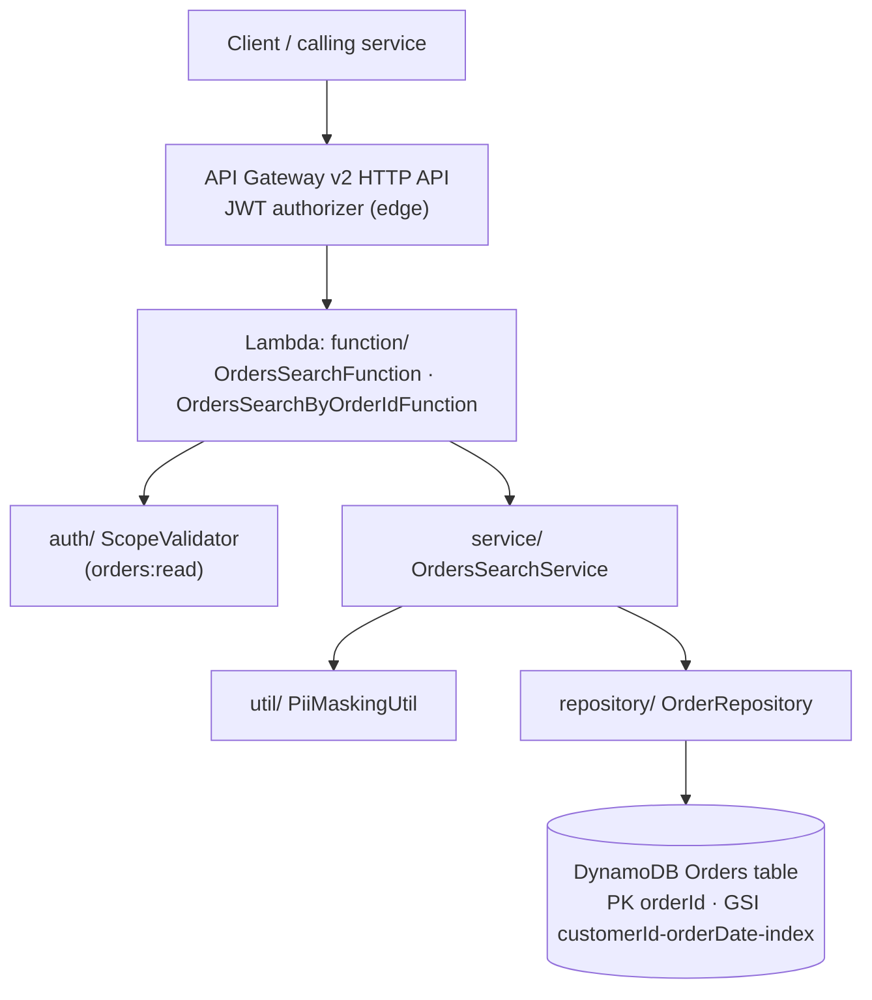
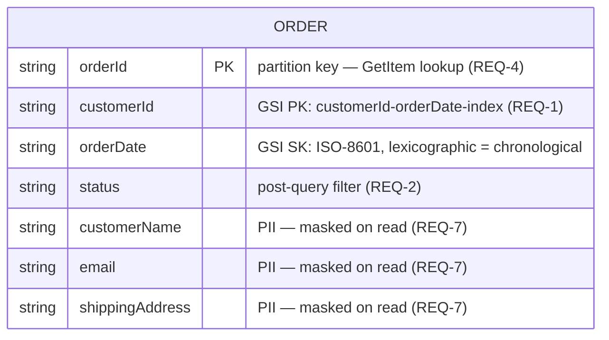
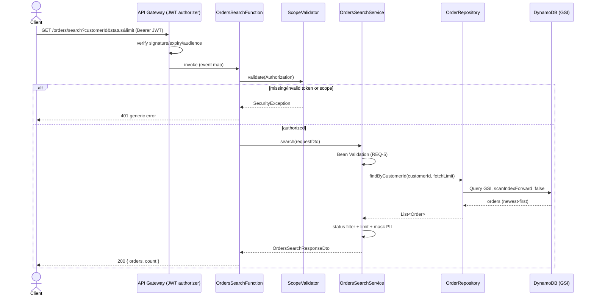
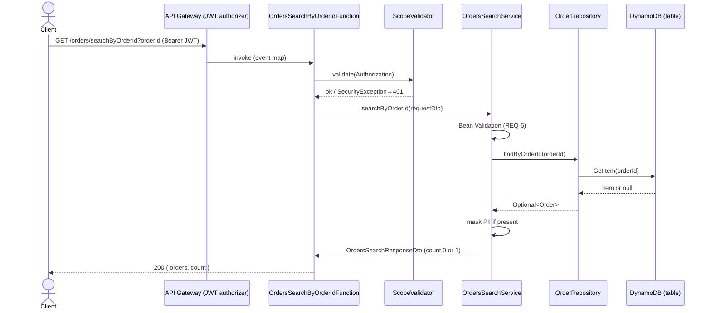

# Design: Orders Search

**Status:** Complete
**Traces to:** `requirements.md` — REQ-1, REQ-2, REQ-3, REQ-4, REQ-5, REQ-6, REQ-7, REQ-8, REQ-9
**Owner:** Orders service team
**Last updated:** 2026-09-17

> Reverse-engineered from the implemented code under
> `src/src/main/java/com/arc/orderslambda`. Documents the Orders Search
> capability (Maven artifact `com.arc:orders-lambda`) that the `payments-service`
> repository actually implements. See `.kiro/steering/product.md`.

---

## 1. Overview

Orders Search is a serverless read API that lets an authenticated, `orders:read`-scoped
caller retrieve a customer's orders (newest-first, optional status filter, bounded
limit) or fetch a single order by id. It runs as an AWS Lambda (Spring Cloud Function,
Java 21) behind an API Gateway v2 HTTP API and backed by a DynamoDB Orders table, and
it masks all customer PII before returning any response.

---

## 2. Architecture Diagram



**Component notes:**
| Component | Responsibility | Satisfies |
|---|---|---|
| `OrdersSearchFunction` | Parse `GET /orders/search` event, scope-check, delegate, map status codes | REQ-1, REQ-2, REQ-3, REQ-6, REQ-8 |
| `OrdersSearchByOrderIdFunction` | Parse `GET /orders/searchByOrderId` event, scope-check, delegate | REQ-4, REQ-6, REQ-8 |
| `ScopeValidator` | Parse Bearer JWT, enforce `orders:read` scope | REQ-6 |
| `OrdersSearchService` | Validate, orchestrate query, status filter, limit bound, mask PII | REQ-1, REQ-2, REQ-3, REQ-5, REQ-7 |
| `OrderRepository` | DynamoDB GSI Query and primary-key GetItem | REQ-1, REQ-3, REQ-4 |
| `PiiMaskingUtil` | Mask name, email, shipping address | REQ-7 |
| `application.yml` / env | Resolve table name + region from env, no hardcoded config | REQ-9 |

---

## 3. Data Model

Single DynamoDB table mapped by the `Order` `@DynamoDbBean`. Table name resolved
at runtime from `ORDERS_TABLE_NAME` (REQ-9). PII attributes are stored raw and
masked on read (REQ-7); the GSI supports customer-scoped, date-sorted queries.



There is one entity and no relational joins — DynamoDB access is by primary key
(`orderId`) or by the `customerId-orderDate-index` GSI. Encryption at rest is
provided by the managed table (infra concern; org `security.md`).

---

## 4. Sequence Diagram(s)

### 4.1 Search a customer's orders (`GET /orders/search`)



**Satisfies:** REQ-1, REQ-2, REQ-3, REQ-5, REQ-6, REQ-7, REQ-8

### 4.2 Look up a single order (`GET /orders/searchByOrderId`)



**Satisfies:** REQ-4, REQ-5, REQ-6, REQ-7, REQ-8

---

## 5. State Diagram (if the entity has a lifecycle)

N/A — Orders Search is a read-only feature. It does not create or transition
order state; `status` is read and filtered but never mutated by this service.

---

## 6. UI Layout (if applicable)

N/A — this is a machine-to-machine HTTP API with no user interface.

---

## 7. API / Interface Contract

Both routes require a valid Bearer JWT carrying the `orders:read` scope (REQ-6).
Success bodies set `Content-Type: application/json`; error bodies are JSON with
the message safely escaped (REQ-8).

```
GET /orders/search?customerId=<string>&status=<string?>&limit=<int?>
  customerId : required, non-blank
  status     : optional, case-insensitive equality filter
  limit      : optional integer, default 20; response bounded to limit,
               fetch bounded to max 100
Response: 200 { "orders": [ { orderId, customerId, status, orderDate,
                              customerName*, email*, shippingAddress* } ],
                "count": <int> }        (* = masked)
          400 { "error": "customerId is required | limit must be an integer | validation failure" }
          401 { "error": "generic auth error" }
          500 { "error": "Internal server error" }

GET /orders/searchByOrderId?orderId=<string>
  orderId : required, validated
Response: 200 { "orders": [ <0 or 1 masked order> ], "count": 0|1 }
          400 { "error": "validation failure" }
          401 { "error": "generic auth error" }
          500 { "error": "Internal server error" }
```

---

## 8. Error Handling

| Condition | Behavior | Satisfies |
|---|---|---|
| Missing/blank `customerId` | `400` with field message | REQ-1 |
| `limit` not an integer | `400` "limit must be an integer" | REQ-3 |
| Bean Validation failure / null request | `400` with field detail | REQ-5 |
| Missing/non-Bearer/empty/unparseable token | `401` generic | REQ-6 |
| Token missing `orders:read` scope | `401` insufficient scope | REQ-6 |
| Order not found (lookup by id) | `200` empty result, `count: 0` (not an error) | REQ-4 |
| Unhandled exception (e.g. DynamoDB failure) | `500` generic, detail logged server-side, no stack trace to client | REQ-8 |
| Any PII in a response/log | Masked via `PiiMaskingUtil`; identifiers only in logs | REQ-7 |

---

## 9. Testing Strategy

Follows the test pyramid and org `test-conventions.md`: many fast unit tests,
a thin integration layer against DynamoDB Local, functional checks per acceptance
criterion, and property-based tests for the masking/ordering invariants.

### 9.1 Unit Testing

Scope: individual classes in isolation with collaborators mocked (Mockito). Fast
enough to run on every save.

| Component | Test File | Key Scenarios | Satisfies |
|---|---|---|---|
| `OrdersSearchService` | `service/OrdersSearchServiceTest.java` | Happy-path search; status filter match/no-match/case-insensitive; limit default & bounding; lookup found/not-found; null/invalid request | REQ-1, REQ-2, REQ-3, REQ-4, REQ-5, REQ-7 |
| `ScopeValidator` | `auth/ScopeValidatorTest.java` | Missing header; non-Bearer scheme; empty token; unparseable token; missing scope; string-form scope; array-form scope | REQ-6 |
| `PiiMaskingUtil` | `util/PiiMaskingUtilTest.java` | Email (normal, short local part ≤4, no `@`); name (single/multi-word); address (digits kept, letters masked); null/blank inputs | REQ-7 |
| `OrdersSearchFunction` | `function/OrdersSearchFunctionTest.java` | Header extraction; query-param parsing; non-integer `limit`; status mapping 200/400/401/500; JSON escaping | REQ-1, REQ-3, REQ-6, REQ-8 |
| `OrdersSearchByOrderIdFunction` | `function/OrdersSearchByOrderIdFunctionTest.java` | Valid lookup; empty result; auth failure; error mapping | REQ-4, REQ-6, REQ-8 |

**What belongs here:** validation branches, filtering/limit logic, masking, scope
parsing, status-code mapping. **What doesn't:** anything needing a real DynamoDB —
that's 9.2.

### 9.2 Integration Testing

Scope: verifies real component interaction against a local DynamoDB, catching
key-schema/GSI contract mismatches a mock can't.

| Integration Point | Test Approach | Key Scenarios | Satisfies |
|---|---|---|---|
| `OrderRepository` ↔ DynamoDB | DynamoDB Local (Testcontainers), real table + GSI | GSI query returns newest-first; limit honored; `GetItem` hit/miss | REQ-1, REQ-3, REQ-4 |
| `OrdersSearchService` ↔ `OrderRepository` ↔ DB | Local DynamoDB, seeded data | End-to-end masking applied to persisted rows; status filter on real rows | REQ-2, REQ-7 |

### 9.3 Functional Testing

Scope: black-box against the deployed function/API per acceptance criteria.

| Scenario | Steps | Expected Result | Satisfies |
|---|---|---|---|
| Search returns masked orders | 1. Seed orders for a customer 2. GET /orders/search with valid token | 200, orders newest-first, PII masked, count set | REQ-1, REQ-7 |
| Status filter | 1. Seed mixed statuses 2. GET with `status=SHIPPED` | Only SHIPPED orders returned | REQ-2 |
| Missing customerId | 1. GET /orders/search without `customerId` | 400 field error | REQ-1 |
| Unauthorized | 1. GET with no/invalid token | 401 generic | REQ-6 |
| Lookup miss | 1. GET /orders/searchByOrderId with unknown id | 200, empty list, count 0 | REQ-4 |

### 9.4 Property-Based Testing

| Requirement | Property (holds for any valid input) |
|---|---|
| REQ-3 | For any `limit ≥ 1` and any result set, the returned item count ≤ `limit` and fetched rows ≤ 100. |
| REQ-1 | For any set of orders for a customer, results are non-increasing by `orderDate` (newest-first). |
| REQ-7 | For any order, no response/log field contains the raw `customerName`, `email`, or `shippingAddress` substring. |
| REQ-2 | For any `status` filter, every returned order's status equals it case-insensitively. |

> Ask Kiro: "Run property-based tests for this spec and show me any failures" once tasks.md is generated.

### 9.5 Test Coverage

| Scope | Target | Enforced By |
|---|---|---|
| Overall branch coverage | ≥ 80% | JaCoCo `check` in `mvn verify` — build fails below 0.80 |
| New/changed code in this feature | ≥ 90% | Diff-coverage review on PR |
| Business-critical paths (auth scope check, PII masking) | 100% | Required test cases in 9.1 + review |
| Error-handling branches (Section 8) | 100% | Every row in the Error Handling table needs a test |

**How coverage is measured:** JaCoCo agent + report via `mvn verify` (run from
`src/`); the report is the `jacoco` output under `target/site/jacoco`. Coverage is
a floor, not a target — cross-check the report against Section 8's error table and
the 9.1–9.3 scenarios, not just the aggregate number.

### 9.6 Testing Tools

| Test Type | Tool / Framework | Stack | Notes |
|---|---|---|---|
| Unit | JUnit 5 + Mockito | Java 21 | Runs on save via the `test-on-save` hook |
| Integration | JUnit 5 + Testcontainers (DynamoDB Local) | Java 21 | Requires local Docker |
| Functional / E2E | REST client against a deployed test stage (e.g. Postman/Newman) | — | Runs against a deployed environment, not localhost mocks |
| Property-based | jqwik | Java 21 | Generated inputs; failures shrink to a minimal counterexample |
| Coverage reporting | JaCoCo (`jacoco-maven-plugin`) | Java 21 | Enforces the 80% branch gate in `verify` |

---

## 10. Open Questions

- [ ] Should status filtering move to a DynamoDB `FilterExpression` if per-customer
  order volume grows well beyond the 100-item fetch bound? (owner: service team)
- [ ] Is a pagination token needed for large histories, or is the `limit` bound
  sufficient for current callers? (owner: service team)
- [ ] `jqwik` and Testcontainers are not yet in `pom.xml` — add them before
  implementing 9.2/9.4, or adjust the plan to the tools actually approved.
